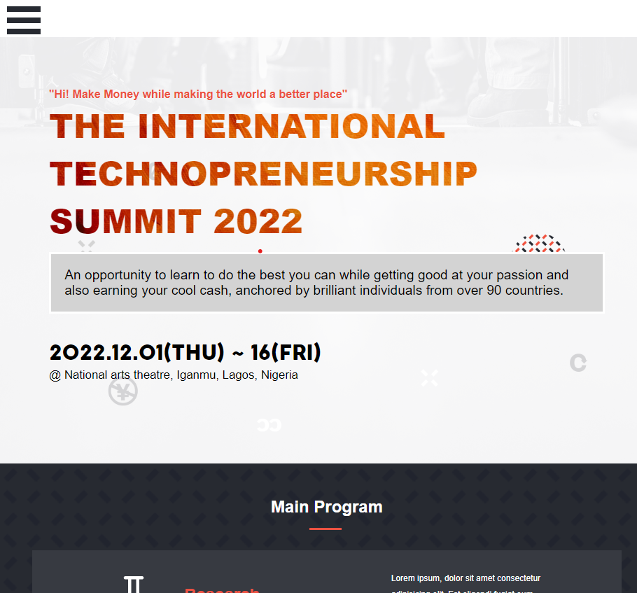
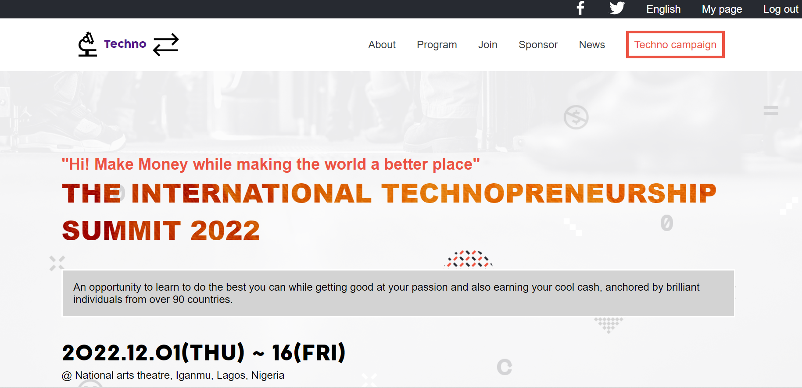

# Technopreneurship

This is a project acknowledging and affirming that I have properly understood everything learnt so far from the first module.

  

  

This project is to put to test the understanding of individual student on what they've studied so far from the curriculum's module 1.

## Built With

- HTML
- CSS
- JAVASCRIPT

Click [here](https://www.loom.com/share/1b0968f84b46450fa426ca8cf6bd0d68) to watch a walk-through description, given by me.

## Live Demo

Here is a live quick demo
[Live Demo Link](https://adnanolarmmi.github.io/Technopreneur/)

## Getting Started

To get a local copy up and running:

1. Clone this repository or download the Zip folder:

**``git clone https://github.com/AdnanOlarmmi/Technopreneur.git``**

2. Navigate to the location of the folder in your machine:

**``you@your-Pc-name:~$ cd <folder>``**

## Author

👤 **Is-haq Adnan Olamilekan**

- GitHub: [@AdnanOlarmmi](https://github.com/adnanolarmmi)
- Twitter: [@AdnanIs71755510](https://twitter.com/AdnanIs71755510)
- LinkedIn: [Adnan (Olamilekan) Is-haq](https://linkedin.com/in/adnan-is-haq-olamilekan)

## Credits

- The original design ideal by [Cindy Shin in Behance](https://www.behance.net/adagio07)

- Project from [Microverse](https://bit.ly/MicroverseTN) html & css module
- Images inspired [Unsplash](unsplash.com)
- Topic inspired by [Khadija Hamdani](https://www.researchgate.net/publication/329972741_Knowledge_based_entrepreneurship_the_role_of_networks)

## Contributing

Contributions, issues, and feature requests are welcome!

## Show your support

Give a ⭐️ if you like this project and how we manage to build it!

## 📝 License

This project is [MIT](MIT.md) licensed